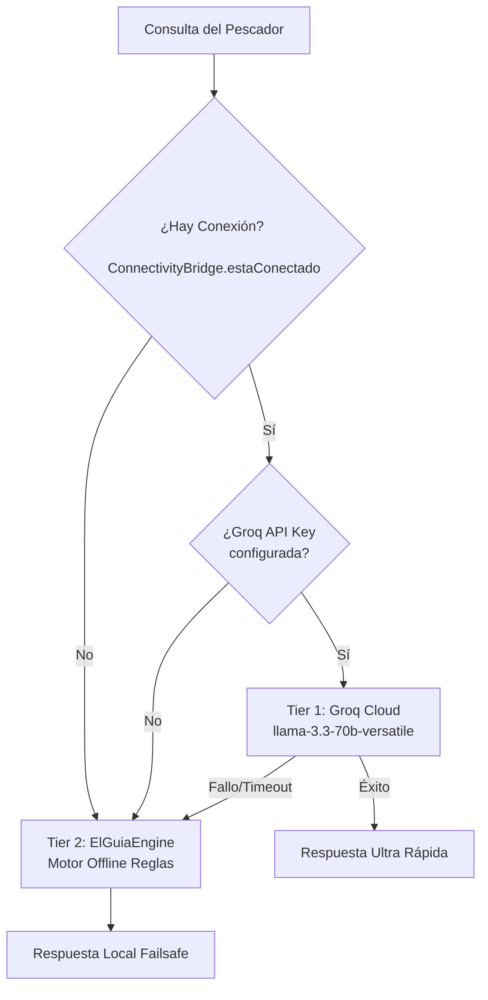

# Capitán YA — Master App

Aplicación híbrida (online/offline) para la gestión y asistencia de pesca deportiva en el Río Paraná, Argentina.

---

## 🧠 Arquitectura de Asistencia IA Híbrida (El Guía)

El sistema de asistencia de chat ("El Guía") implementa un **orquestador inteligente de confianza y conectividad de dos capas** (`BaqueanoIAService`) para garantizar respuestas rápidas y funcionales, tanto en la comodidad del hogar como en el medio del río sin señal de celular.

### 📶 Capas de Ejecución (Tiers)

1. **Tier 1: Groq Cloud (En línea principal)**
   - **Clase**: [GroqService](file:///c:/CapitanYA/capitan11.5.2026/lib/services/groq_service.dart)
   - **Condición**: Conexión a internet activa y API Key de Groq válida.
   - **Modelo**: `llama-3.3-70b-versatile` (configurable).
   - **Propósito**: Proporcionar respuestas en menos de 1 segundo utilizando modelos de lenguaje masivos en la nube, optimizando la experiencia del usuario.

2. **Tier 2: ElGuiaEngine (Offline estricto - Failsafe)**
   - **Clase**: [ElGuiaEngine](file:///c:/CapitanYA/capitan11.5.2026/lib/services/el_guia_engine.dart)
   - **Condición**: Sin conexión a internet, o caída/fallo en el Tier 1.
   - **Propósito**: Procesamiento semántico local mediante expresiones regulares, reglas de intención de pesca y bases de datos locales (JSONs y Hive). Garantiza que el asistente siempre responda de forma coherente.

---

## 🛠️ Componentes Clave del Sistema

### 1. Centinela de Red ([ConnectivityBridge](file:///c:/CapitanYA/capitan11.5.2026/lib/services/connectivity_bridge.dart))
Escucha activamente el estado de red a través de `connectivity_plus`. Modifica reactivamente el flujo del orquestador y se encarga de manejar el "Modo Trinchera" (sin señal), guardando las acciones del usuario en un buzón de Hive local para sincronizarlas con Supabase por lotes cuando se restablezca la conexión.

### 2. Auto-Aprendizaje ([GeminiLearner](file:///c:/CapitanYA/capitan11.5.2026/lib/services/gemini_learner.dart))
Los modelos en línea (Groq / Gemini) reciben instrucciones para empaquetar conceptos nuevos detectados durante la charla dentro de un bloque especial `|||APRENDO|||` con formato JSON. El backend procesa esto en segundo plano para alimentar las bases de datos offline locales, permitiendo que "El Guía" aprenda en línea y responda de forma inteligente sin conexión más tarde.

### 3. Configuración Dinámica ([GroqConfig](file:///c:/CapitanYA/capitan11.5.2026/lib/config/groq_config.dart))
Permite gestionar las variables de Groq persistidas en `SharedPreferences` con fallback automático al archivo `.env` (`GROQ_API_KEY`). El panel de administración (`AdminGuiaEducadorScreen`) ofrece una interfaz amigable para ingresar claves y probar conexiones.

---

## 📝 Mantenimiento y Modificaciones Comunes

* **Actualizar el Modelo de Groq**:
  Modificar la constante `defaultModel` en [groq_config.dart](file:///c:/CapitanYA/capitan11.5.2026/lib/config/groq_config.dart) o cambiarlo a través del panel de configuración de administración.
* **Ajustar el Tiempo de Espera (Timeout)**:
  El timeout de Groq está configurado en 10 segundos en [groq_service.dart](file:///c:/CapitanYA/capitan11.5.2026/lib/services/groq_service.dart). Puede reducirse si se requiere una caída al Tier 2 más agresiva.
* **Instrucciones de Identidad**:
  Si se necesita alterar la personalidad ribereña de "El Guía", modificar [CapacitacionService](file:///c:/CapitanYA/capitan11.5.2026/lib/services/capacitacion_service.dart), que inyecta dinámicamente la identidad y las reglas a todos los motores de lenguaje.
